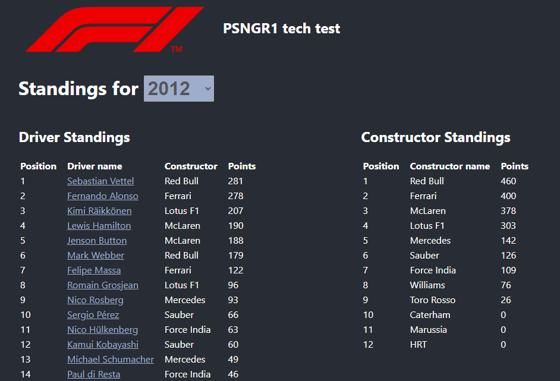
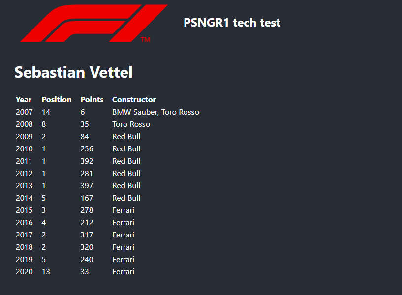

# PSNGR1 React tech test

Hi there!

Welcome to our tech test for React.

Here are the steps you need to follow:

1. Create a fork of the repository
2. Add [@vizath](https://github.com/vizath) as a collaborator, and remove any other collaborators there might be
3. Make the test (see below)
4. Commit often
5. *** Do **not** open a PR ***
6. Inform us that you've completed your work

## The scope of the test

The test will be about listing results of past Formula 1 races using the following API: [http://ergast.com/mrd](http://ergast.com/mrd)

Considerations:

- We do not expect impecable styling, since this is not a portfolio project. The goal is to understand how you code and manage state.
- The API requires you to put a `.json` at the end of the url to return the response in json format.
- Even if Typescript is installed in the project, it is not a requirement to use it.
- Assuming you know well React, we expect the test to take between 2-4 hours to complete.

There is already some libraries included in the project, but feel free to add more if you see fit:

- Redux
- Redux thunk
- Rxjs & Redux observable
- Styled components
- React Router
- Typescript
- axios
- qs

### 1. List the driver and constructor/team standings upon the selection of a year

Have a way to select a year between 1950 and now. When the user selects the year, show the standings for the drivers and the constructors.

### 2. List the past standings when selecting a driver

When clicking on a driver, redirect the user to its driver's page. The driver's page should list the past standings of the specified driver.

## Available Scripts

This project was bootstrapped with [Create React App](https://github.com/facebook/create-react-app).

In the project directory, you can run:

### `yarn start`

Runs the app in the development mode.\
Open [http://localhost:3000](http://localhost:3000) to view it in the browser.

The page will reload if you make edits.\
You will also see any lint errors in the console.

## Learn More

You can learn more in the [Create React App documentation](https://facebook.github.io/create-react-app/docs/getting-started).
